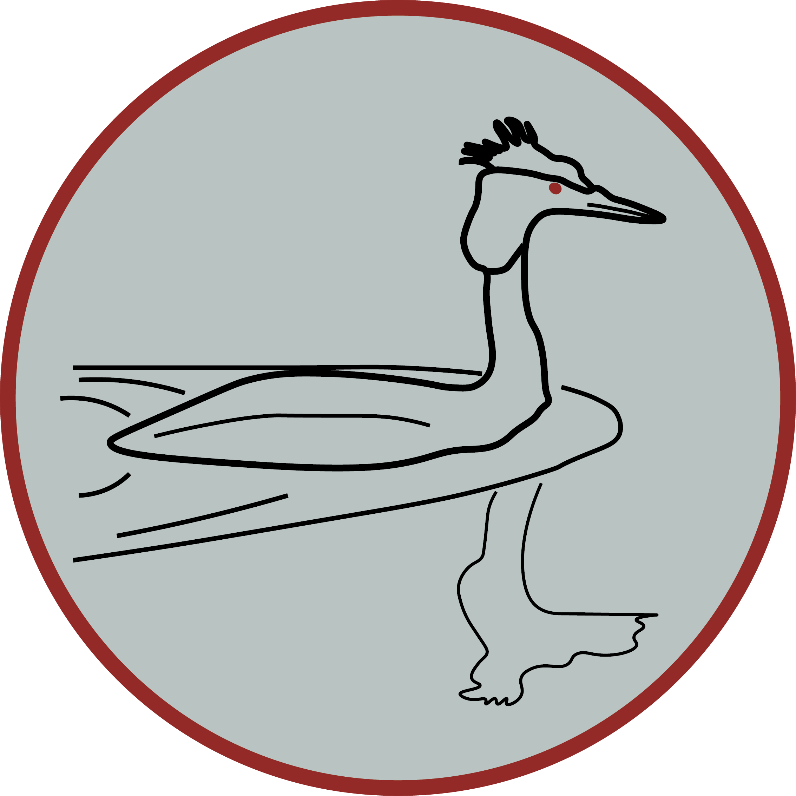

<p align="center"></p>

# Grebe

Grebe is a platform of daily puzzle games played on the **tree of life** — the
shared-ancestry tree that connects every living thing. Each game is new every day and the
same for all players. Three games ship today:

- **Lineage** — guess the hidden organism; every wrong guess is placed on a shared-ancestry
  tree at the clade it has in common with the answer, so each miss narrows down where the
  answer sits. Inspired by [Metazooa](https://metazooa.com).
- **Kinship** — sixteen species, four hidden groups of four, each group a real clade; sort
  them before four mistakes run out. A daily grid in the spirit of the New York Times'
  [Connections](https://www.nytimes.com/games/connections).
- **Branches** — rebuild a slice of the tree: a labelled skeleton of clades (all from one
  class), some showing a worked-example species, and a tray of species to drag onto the branch
  they belong to. A Grebe original.

All three run on one bundled taxonomy snapshot, built Wikipedia-first: the species are chosen by
how widely they're read about on Wikipedia and connected by the Open Tree of Life. Grebe is
local-first: everything runs in the browser, and an optional account adds cross-device sync and
leaderboards.

## Games

### Lineage

The player names organisms; each wrong guess is placed on the tree at the clade it shares
with the hidden answer. Two controls are coordinates on the tree rather than difficulty dials:

- **Scope** is where the tree is rooted (e.g. "Birds" roots it at `Aves`) — not only animals,
  but also chordates, plants, or all of life.
- **Resolution** is how close a guess must land to count as a win. It indexes a rank ladder
  (`0` = exact species, `1` = same genus, `2` = family, `3` = order). Free play offers all four;
  the daily ramp uses only family → genus → species (order is too unevenly tagged to be fair).

Alongside the shared-ancestry feedback, each guess carries a warmth score rescaled to the
current scope, so the signal stays meaningful even in narrow modes (in a birds-only game every
guess already shares `Aves`, which a global score would read as uniformly "hot"). There is a
shared daily with a leaderboard, plus free play for practice.

### Kinship

A 4×4 grid of sixteen species split into four hidden groups of four; each group is a real,
recognisable clade ("Owls", "Sandpipers"). Pick four tiles you think share a group and guess;
a correct group locks in and its clade name is revealed, a wrong one costs one of four
mistakes.

Difficulty is not the breadth of each group (groups are always tight and recognisable) — it is
the **separation** between the four groups, and it ramps by weekday in lock-step with Lineage's
difficulty tier. An easy board draws its four groups from far-apart branches (a frog, a fern, a
beetle, a crab); a hard board draws four sibling clades that all look alike (four kinds of
perch). Within a board the yellow→purple colour ranks the groups by how confusable they are —
the two clades sitting closest together on the tree get the hard colours, the "trap" pair.
The board is deterministic per date, and Kinship has its own ranked daily leaderboard (scored
by difficulty and mistakes).

### Branches

You're given part of the tree: a skeleton of named clades, all within a single class, some
already showing a worked-example species, plus a tray of species to slot onto the branch they
belong to. Drag each species onto its group; get them all right to win, with partial credit for
the ones you place correctly.

Difficulty builds by weekday, in lock-step with the other games' tiers, through several levers
at once. Easy days present broad, well-separated clades with a worked example on most branches;
harder days tighten the **grain** to sibling clades that look alike, pack the tray with look-alike
names (two sparrows, four clams) so name-matching alone won't solve it, thin out the worked
examples, and from Thursday label the clades scientifically (with the rank hidden on the
weekend). Because every board stays within one class, placing a tile is always a which-of-these-groups
question, never a cross-kingdom mix. The species to place are all common-named and lean toward the
more recognisable members of each clade. The skeleton can be read two ways, as a top-down cladogram
or a circular fan, sharing the same layout engine as Lineage. Tapping a clade or anchor for its
Wikipedia is free; looking up a species you still have to place is a penalised peek (half a point),
and the species-to-place tiles carry a Wikipedia thumbnail you can enlarge for free. Branches is an
original, not modelled on an existing game.

## Stack

React 18 + TypeScript, built with Vite. Three runtime dependencies (`react`, `react-dom`,
`@supabase/supabase-js`). The optional account layer aside, the games run entirely in the browser.

## Running

```bash
npm install
npm run dev        # http://localhost:5173
npm run build      # typecheck + production build
npm run typecheck  # types only
npm test           # vitest unit tests
```

Node 18+. The app needs no server of its own: the taxonomy and fonts are bundled and every
daily is computed client-side, so you can play with no network. (It still fetches a Wikipedia
blurb when a round ends.)

## Architecture

The game logic is a set of pure functions over a tree. It lives in `src/core/` and imports
nothing from React or the DOM; everything else is arranged around it.

```
src/
  core/              portable engine — no React, no DOM
    types.ts         shared shapes (TaxonNode, GameConfig, GuessResult)
    tree.ts          build/index the tree; ancestry, MRCA, descendants, distance
    game.ts          evaluateGuess + scope-relative warmth + rank-ladder win logic
    daily.ts         deterministic daily pick (seeded by date + scope) + puzzle number
    solver.ts        informed "par" solver for Lineage
    grid.ts          Kinship board generator (pure, deterministic per date + tier)
    branches.ts      Branches board generator (pure, deterministic per date + tier)
    resolve.ts       typed name -> node
    index.ts         public barrel — UI imports from "../core" only
  data/
    taxonomy.json    the bundled tree (built by the scripts/ pipeline; see scripts/PIPELINE.md)
    loadTaxonomy.ts  the single source of the tree
    presets.ts       scope + resolution presets
    dailySchedule.ts weekday resolution/assist ramp + spaced scope draw + answer pick (Lineage)
    clades.ts        clade groupings for per-group stats/leaderboards
    cladeNames.ts    friendly common names for clades (group guesses + Kinship labels)
    score.ts         difficulty-weighted points per game
    stats.ts         local stats model (streaks, points, per-clade tallies)
    gridDaily.ts     today's Kinship board (tier from the weekday ramp)
    gridProgress.ts  per-day Kinship attempt persistence
    branchesDaily.ts    today's Branches board (tier from the weekday ramp)
    branchesProgress.ts per-day Branches attempt persistence
    games.ts         optional account + leaderboard calls
    wikipedia.ts     Wikipedia summary + article links for the reveal card
  hooks/
    useGame.ts         couples the Lineage engine to React state
    useGridGame.ts     couples the Kinship board to React state
    useBranchesGame.ts couples the Branches board to React state
    useStats.ts      local stats, synced when signed in
    usePlayer.ts     account session and display name
  ui/                presentational components (HomePanel, GridGame, Cladogram, …)
```

Because `core/` and `data/` have no UI dependencies, they are portable to a native
(React Native / Expo) shell; only `ui/` and the hooks are web-specific.

## Daily puzzles

`dailySchedule.ts` turns a date into a puzzle deterministically, so every player gets the same
puzzle without a server round-trip:

- The **weekday** sets the difficulty. For Lineage that is a win-**resolution** ramp with
  **assist**: family + assist (Mon/Tue) → genus + assist (Wed) → exact species (Thu–Sun, assist
  off at the weekend). The weekday is also the leaderboard's point weight (fixed to the day) and
  the tier Kinship reuses for group-separation and Branches for its grain, look-alike-name floor
  and label reveal — so all three games get harder across the week together.
- **Scope is decoupled from difficulty**: a per-day seeded draw over all scopes, with a short
  anti-repeat so no group clusters, purely for variety.
- The **answer** is a prominence-weighted draw from the scope's leaves (famous species early in
  the week, uniform by Sunday), skipping anything used within the anti-repeat window and — on
  family/genus days — anything whose lineage lacks that rank, so the advertised win tolerance is
  never silently downgraded.

Because this is seeded rather than truly random, each puzzle is a pure function of the date and
is fully reproducible (and, with the source public, computable in advance).

## Taxonomy

`src/data/taxonomy.json` is generated by the pipeline in `scripts/` (documented step by step in
[scripts/PIPELINE.md](scripts/PIPELINE.md)). It is built **Wikipedia-first**: what a species *is*
to the game comes from how many people read about it, not how often it's recorded in the field.

- **Selection** — species are chosen by English-Wikipedia pageviews over a ~60-day window, so the
  pool skews toward organisms people actually recognise rather than the best-sampled ones. Capped
  for balance (at most three species per genus, plus a prominence-scaled per-family cap).
- **Topology** — the branching structure, named clades (Amniota, Tetrapoda…), and ranks come from
  the [Open Tree of Life](https://tree.opentreeoflife.org) synthetic tree.
- **Names** — each species' common name is its Wikipedia article title, falling back to the
  Wikidata "common name" property (P1843); clade names come from that same Wikidata property, with
  a small hand-curated override table on top.
- **[GBIF](https://www.gbif.org)** supplies only a stable per-species identifier. It's load-bearing
  (Open Tree reuses some ids for both a clade and a tip, so keying species by their own GBIF id
  keeps them from colliding with clade nodes), but it no longer drives selection or names.

The baked snapshot holds roughly 3,800 species across about 10,800 nodes. A second, larger index
of ~21,600 guessable taxa (species plus clade groups, each with its graft lineage and pageviews)
lives in the database and powers guess coverage and the depth behind Kinship and Branches.
Regenerating either is the only step that touches the network.

## Scoring

All three games share a difficulty weight, the day's tier (`90 + 10 × tier`, i.e. 100 on Monday
to 160 on Sunday), so scores are comparable across the week.

**Lineage:** `weight × efficiency × hint-factor`, zero for a loss. Efficiency decays gently
with guess count and the hint factor drops with an escalating penalty per hint.

**Kinship:** `weight × (1 − mistakes/4)`, zero for a loss. A clean board earns the full weight
and each mistake shaves a quarter.

**Branches:** `weight × (correct − penalties) / slots`, zero for a blank board. A revealed slot
forfeits its whole point, and looking up a species you still have to place forfeits half.

## Limitations

- **Name matching is forgiving but bounded.** `resolve.ts` matches common/scientific names
  (case-, diacritic-, and hyphen-insensitive), a curated synonym table (`data/synonyms.ts`, e.g.
  "orca" → killer whale), and a conservative typo-tolerant fallback (unambiguous edit-distance ≤2,
  never fuzzing very short words). Pulling the full alias set from each species' Wikipedia redirects
  at build time is the remaining enhancement.
- **Folk categories are not clades.** "Fish", "reptiles", and "bugs" are not monophyletic;
  where a scope follows folk intuition rather than strict cladistics that is a deliberate
  simplification.
- **Kinship difficulty tracks tree-clustering**, which is a proxy for perceived hardness rather
  than a measure of it — a mid-week board can land on an unusually tricky group.
- **Accounts have no email**, so a forgotten password cannot be recovered.

## Testing

`npm test` runs the Vitest suite: a scoring golden-table, daily
determinism, the Lineage win-rank ladder and solver-par bounds, streak logic, and the Kinship
board generator (structure, determinism, difficulty ordering, one-away detection).

## References

- **[Metazooa](https://metazooa.com)** (and its plant counterpart Metaflora) — the daily
  animal-guessing game that inspired **Lineage**.
- **[Connections](https://www.nytimes.com/games/connections)** (The New York Times) — the
  grouping game that inspired **Kinship**.
- **[Wikipedia](https://www.wikipedia.org)** — pageviews drive species selection and article
  titles supply common names at build time; also the summary and thumbnail on the reveal card
  (the only third-party request during normal play). If Grebe's any fun, please
  [donate to Wikipedia](https://donate.wikimedia.org).
- **[Wikidata](https://www.wikidata.org)** — the "common name" property (P1843) fills in names
  Wikipedia titles don't cover, and names the clades.
- **[Open Tree of Life](https://tree.opentreeoflife.org)** — synthetic phylogeny; the branching
  topology, named clades, and ranks behind the shared-ancestry hints.
- **[GBIF](https://www.gbif.org)** — Global Biodiversity Information Facility; a stable
  per-species identifier keying the tree.
- **Fonts** — Bricolage Grotesque, Spectral, and Spline Sans Mono (SIL Open Font License),
  self-hosted and bundled with the app (no CDN).

## License

Source-available under the PolyForm Noncommercial License 1.0.0: free to use, modify, and share
for noncommercial purposes; commercial use is not permitted. See [LICENSE.md](LICENSE.md).
